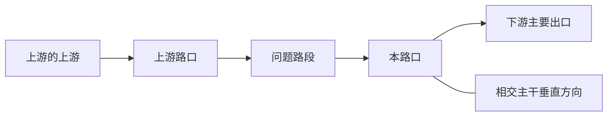
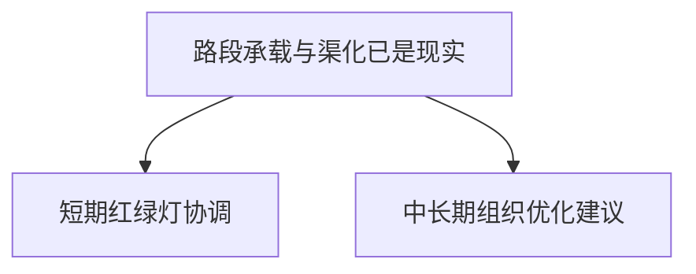
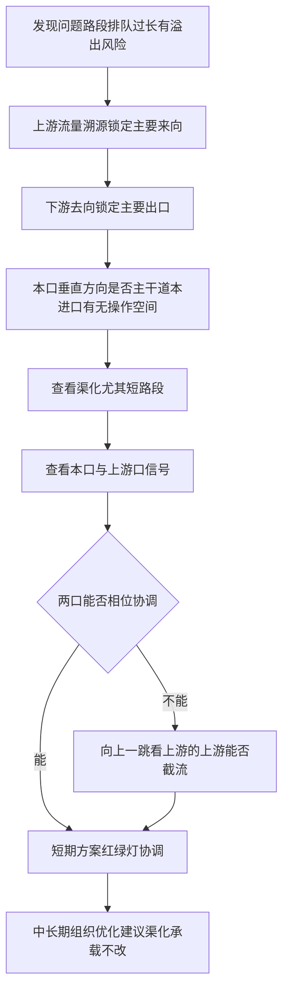
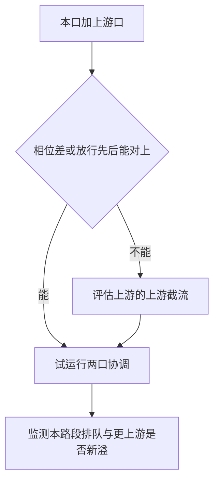

# 排队溢出处置方法

> 网页版（单文件，可拷贝发送）：[overflow-diagnosis.html](overflow-diagnosis.html)
>
> 通用诊断口径。不绑定某一条走廊；文末奥体西仅为对照示例。

某路段排队过长、队尾压回上游路口时，按本文五步定位成因，再分层给出手段。路段承载与渠化是既成现实，短期无法进行土建；**红绿灯协调**才是可落地的短期解，组织优化只作为中长期建议。

---

## 1. 目的与适用范围

适用于：进口道或路段排队接近/超过蓄车长度，存在溢出到上游路口（交叉口内部或上游进口）的风险。

不适用于：仅因事故、施工占道导致的临时阻断（先清障，再谈信控）。

诊断目标是回答三件事：

1. 车从哪来、往哪走。
2. 本进口还有没有加绿或调相序的空间。
3. 短期靠哪一级路口做信号协调或截流。

---

## 2. 空间对象

沿问题路段主方向定义：

| 对象     | 含义                    |
| ------ | --------------------- |
| 问题路段   | 排队过长、存在溢出风险的那一段       |
| 本路口    | 问题路段下游停车线所在交叉口        |
| 上游路口   | 问题路段上游端交叉口，溢出首先回灌此处   |
| 下游主要出口 | 本路口放行后流量最大的去向         |
| 垂直方向   | 本路口相交道路（常为另一条干道）      |
| 上游的上游  | 两口无法协调时，再向上一跳用于截流的交叉口 |

---

## 3. 约束与手段分层

**硬约束**：当前路段的蓄车长度、展宽、车道功能、相交道路等级，都是既成现实。诊断可以指出渠化是否放大了溢出，但不能把「立刻改渠化」当成短期方案。

| 时限  | 手段     | 能做什么                       | 不能做什么           |
| --- | ------ | -------------------------- | --------------- |
| 短期  | 红绿灯协调  | 相位差、放行先后、在不引发更上游溢出的前提下轻微截流 | 加不出相交主干道已经占用的绿灯 |
| 中长期 | 组织优化建议 | 车道功能、禁限、诱导、土建/渠化改造         | 假装几何已经改完        |

先给出能当天试运行的信控方案，再并列写出组织建议，避免把建议误当成已实施方案。

---

## 4. 五步诊断

按顺序做。每一步的输出是下一步的输入，不要跳步用信控「试配」。

### 步骤 1 · 上游流量溯源

**看什么**：问题路段进口各来向的流量份额（比例），必要时向上追溯有限跳数。

**判什么**：哪个方向来量最大 → 锁定**主要上游**。

**产出**：主上游路口、主来向（直行 / 左转 / 右转）。

### 步骤 2 · 下游主要出口

**看什么**：本路口该进口放行后的去向份额。

**判什么**：哪个方向是主要出口；下游承接是否已经卡口。

**产出**：主出口方向；下游是否构成约束。

### 步骤 3 · 本路口垂直方向流量

**看什么**：相交道路等级、垂直向流量/拥堵、本进口现有绿时与饱和情况。

**判什么**：

- 相交道路是否主干道、是否必须保障。
- 本进口是否还有加绿、拉长周期或调相序的**操作空间**。

**产出**：

- 有空间 → 本口配时仍可作为手段之一。
- 无空间（主干道东西向已占满周期）→ 本口不能再向问题方向加绿，后续只能协调或向上截流。

### 步骤 4 · 查看渠化

短路段必须看：蓄车短、展宽不够、车道功能与转向不匹配，都会把同样的到达强度放大成溢出。

**产出**：组织优化建议（改车道功能、展宽、禁限等），**不是**立即施工项。几何结论用于解释「为什么这么容易溢」，并约束短期信控只能在现有蓄车长度内做文章。

### 步骤 5 · 本口与上游口信号

**看什么**：本路口与步骤 1 锁定的上游路口的周期、相位差、放行先后。

**判什么**：两口能否通过相位协调（谁先绿、汇入是否赶在消散之后）缓解溢出。

- **能协调**：短期方案 = 两口红绿灯协调（相位差 / 放行顺序）。可含对上游的轻微截流，前提是需求未明显超过供给、截流不至于把溢出再向上推一跳。
- **两口都无法协调**：再向上一跳，看**上游的上游**能否截流，把到达强度压到本路段蓄车可承受的范围。

---

## 5. 总流程与协调升级

协调升级只解决「在哪一级路口动手」，不改变硬约束：截流点可以上移，路段几何仍然不改。

---

## 6. 附录：奥体西对照（示例，不是方法本身）

晚高峰奥体西路北向南，解放东路 → 经十路路段排队过长，存在溢出到解放东路口的风险。下表只说明五步如何落到这一例，不作为通用流程的唯一形态。

| 步骤     | 本例对照                                                    |
| ------ | ------------------------------------------------------- |
| 问题路段   | 奥体西路北→南，解放东 → 经十；专家排队 270 m                             |
| 1 上游溯源 | 主来向来自上游解放东路–奥体西路口                                       |
| 2 下游出口 | 本口为经十路–奥体西；北进口放行后主要进入南段等去向                              |
| 3 垂直方向 | 经十路为东西向通勤主干，周期内难再向南北向加绿；本进口操作空间不足                       |
| 4 渠化   | 短路段、蓄车有限，几何既成；只形成组织建议，不改土建                              |
| 5 信号   | 两口可做相位协调：现状解放东先放会溢出；优化后经十先放、队列消散后再汇入。需求未超供给，故用轻微截流而不是加绿 |

本例的短期解是**相位协调**（放行先后），不是给北进口加绿。若解放东与经十两口无法协调，才需要再向上看解放东的上游能否截流——本例未走到这一跳。